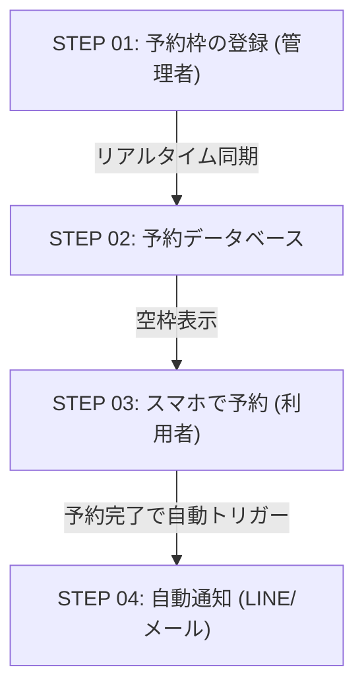

# 実装計画：ユースケース3（ポータル予約システム）インフォグラフィック化とレスポンシブ改修

ユーザー様からのフィードバックに基づき、横スクロールバーを完全に廃止し、よりグラフィカルでリッチな「インフォグラフィック風」のデザインへとユースケース3を刷新します。

## ユーザー確認が必要な事項

> [!IMPORTANT]
> **レイアウトと構成の変更点**
> 1. **横スクロールの廃止**: `overflow-x-auto` および固定幅の `min-w-[1000px]` を削除し、画面幅に応じて綺麗に伸縮・折り返される完全レスポンシブなレイアウトへ変更します。
> 2. **インフォグラフィック的アプローチへの刷新**: 単なる四角い枠や矢印の連続ではなく、各ステップに「STEP 01」「STEP 02」といった進行順のバッジ、役割別のグラデーション（管理者／データベース／利用者）、視覚的にわかりやすいSVGコネクタ等を配置し、インフォグラフィックのような美しさを目指します。
> 3. **「スマホモックアップ」と「説明文」のレイアウト再配置**: スマホモックアップを右端で無理に横並びにするのではなく、デスクトップ表示ではフローの下部または横の適切な位置に十分な幅をとって配置し、テキストが潰れない設計にします。

---

## 提案する設計案 (レイアウト構成)

### 1. フロー全体のステップ化 (1 -> 2 -> 3 -> 4)
全体の流れを以下の4つのステップからなる、ストーリー仕立てのインフォグラフィックに再編します。

- **STEP 01**: 予約枠の登録（API/CSV連携、管理画面からの設定をビジュアル化）
- **STEP 02**: 予約データベース（リアルタイム空枠管理と排他制御をリッチに表現）
- **STEP 03**: スマートフォンでのかんたん予約（モックアップUIを美しく表示）
- **STEP 04**: LINEやメールへの自動通知（現在下部に配置されている通知プレビューとデザイン的に統合）

### 2. デザインの強化（インフォグラフィック化）
- **ステップ・バッジ**: 各ステップに `STEP 01` `STEP 02` といったグラデーション付きのナンバリングバッジを配置。
- **リッチな背景とボーダー**: カードごとにエメラルド系のソフトなグラデーション背景や、シャドウ（`shadow-xl`）を効果的に使った浮き出しエフェクトを適用。
- **コネクタの改善**: デスクトップでは右向きの流れるような矢印、モバイルでは下向きの矢印（SVG）を採用し、レスポンシブに切り替えます。
- **デバイスモックアップ**: スマホ画面の隣にある説明文を、スマホの「下部」または「スマホと並べた十分なスペース」に配置し、フォントサイズや行間を美しく調整します。

---

## 提案する変更内容

### 変更対象ファイル

#### [MODIFY] [usecase_mobile.html](file:///media/ksp-zorin-001/WORK_DISK/workspace/tunageMON/tunageMON/usecase_mobile.html)
- ユースケース3セクション（292行目〜最終 main タグ直前まで）を上記インフォグラフィック風デザインに書き換えます。
- 横スクロールコンテナを削除し、モバイル・デスクトップの双方で崩れない完全レスポンシブ対応とします。

---

## 検証計画

### 1. 自動・手動検証
- **レスポンシブ動作確認**: 開発用のローカルサーバー（Port 8099）を使用し、モバイル（幅375px〜480px）、タブレット（幅768px）、PC（幅1024px以上）の各画面サイズで表示を確認します。
- **スクロールバーの有無**: すべての解像度において不要な横スクロールバーが発生しないことを確認します。
